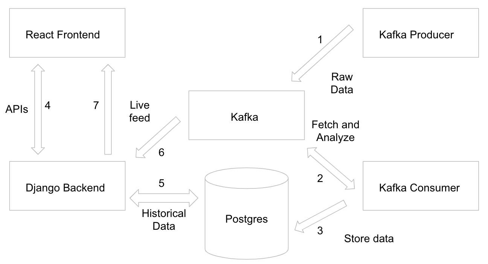
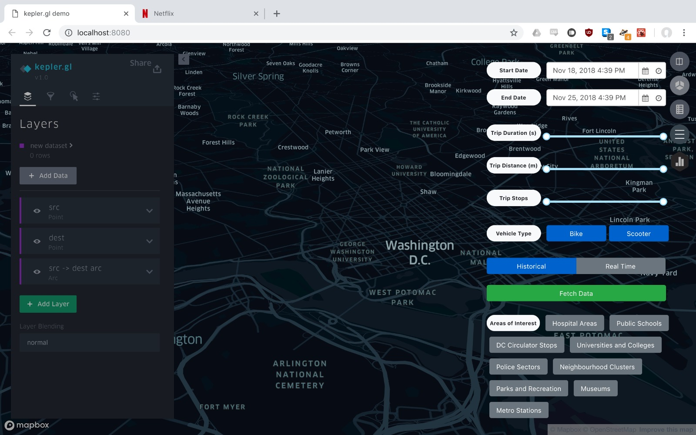
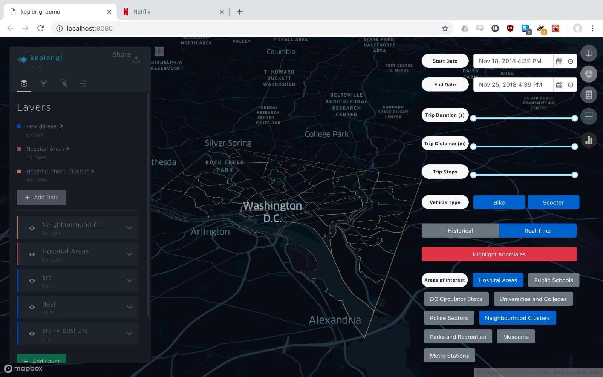
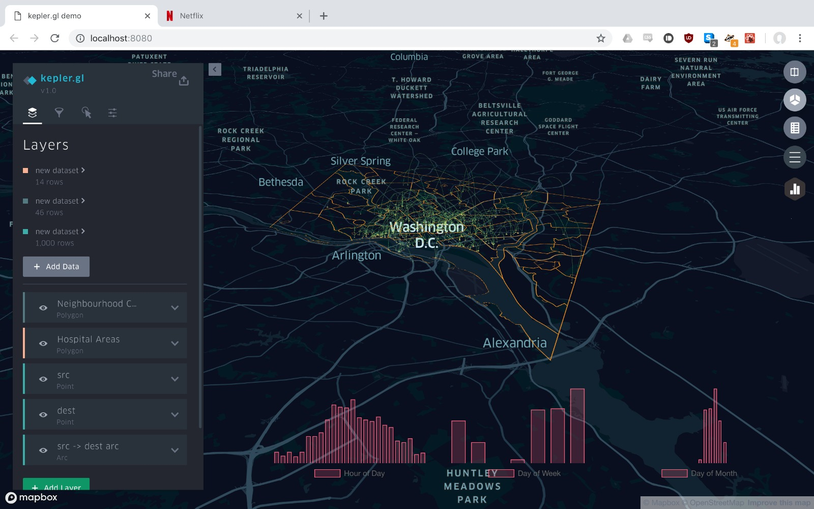

# REALTIMEVIZ

#### Introduction
Realtimeviz is a spatial-temporal analytical tech stack built to collect data from [LimeBike](https://www.li.me/) in the Washington DC Area and analyze the collected data.

#### General Setup
The tech stack uses the following frameworks in one or more components. It is recommended that you set these up first properly before going any further. The system architecture explains about how these components interact with each other.
To avoid issues with setup, it is advisable to set these up using Docker and the instructions to do the same are provided below.

- [Zookeeper](https://zookeeper.apache.org/)
Setup using Docker image [Zookeeper](https://hub.docker.com/_/zookeeper/)
`docker run --name zookeeper --restart always -d -p 2181:2181 -p 2888:2888 -p 3888:3888 -v zookeeper_data:/datalog zookeeper`

- [Kafka](https://kafka.apache.org/quickstart)
Setup using Docker image [wurstmeister/kafka](https://hub.docker.com/r/wurstmeister/kafka/)
`docker run --name kafka1 --restart always -d -p 9091:9091 -e KAFKA_ZOOKEEPER_CONNECT=ZOOKEEPER_IP:2181 -e KAFKA_LISTENERS=PLAINTEXT://:9091  -e KAFKA_ADVERTISED_LISTENERS=PLAINTEXT://KAKFA_QUEUE_URL_1:9091 -e BROKER_ID=1 -e KAFKA_LOG_DIRS=/kafka/logs -v kafka1_data:/kafka/logs wurstmeister/kafka`

- [Postgres](https://www.postgresql.org/) with [PostGis](https://postgis.net/)
Setup using Docker image [kartoza/postgis](https://hub.docker.com/r/kartoza/postgis/)
`docker run --name postgis --restart always -d -p 5432:5432 -e POSTGRES_USER=<USER_NAME> -e POSTGRES_PASS=<PASSWORD> -e POSTGRES_DBNAME=<DB_NAME> -e ALLOW_IP_RANGE=0.0.0.0/0 -v pg_data:/var/lib/postgresql kartoza/postgis:9.6-2.4`

- [Redis](https://redis.io/)
Setup using the Docker image [redis](https://hub.docker.com/_/redis/)
`docker run --name redis --restart always -d -p 6379:6379 redis`

SQL scripts to create the tables are provided [here](https://github.com/datateam/realtimeviz/tree/master/infra)

#### System Architecture

##### Flow
1. [KafkaProducer](https://github.com/datateam/realtimeviz/tree/master/kafka-producer) fetches Lime bike data from their public API in the Washington DC area and pushes it to Kafka

2. [KafkaConsumer](https://github.com/datateam/realtimeviz/tree/master/kafka-consumer) polls data pushed by the producer, analyzes it, generates trips and pushes it back to Kafka for real time feeds

3. KafkaConsumer also pushes both raw and processed trip data into PostgresSQL

4. [Frontend](https://github.com/datateam/realtimeviz/tree/master/frontend) is the analytics dashboard that queries the backend for data

5. [Backend](https://github.com/datateam/realtimeviz/tree/master/backend) Retrieves relevant data from the database based on the API query

6. Backend also polls Kafka to get the real time feed that was generated by the KafkaConsumer in Step 3

7. Frontend uses sockets to communicate with the backend and get data for the realtime feed

#### Components
The tech stack has been broken down into modular components, each of which is responsible for a specific set of tasks. Specific instructions to set these are provided below

- [Producer](https://github.com/datateam/realtimeviz/tree/master/kafka-producer)  
- [Consumer](https://github.com/datateam/realtimeviz/tree/master/kafka-consumer)
- [Backend](https://github.com/datateam/realtimeviz/tree/master/backend)
- [Frontend](https://github.com/datateam/realtimeviz/tree/master/frontend)

#### Screenshots

##### Historical Mode

##### Realtime Mode

##### Supplemtary Graphs

